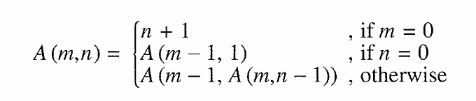
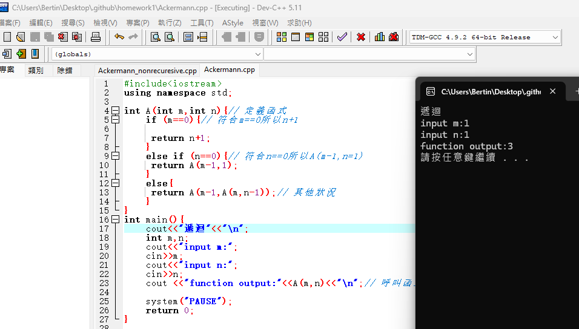
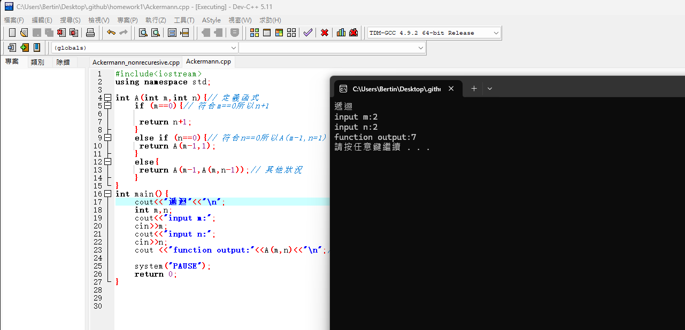
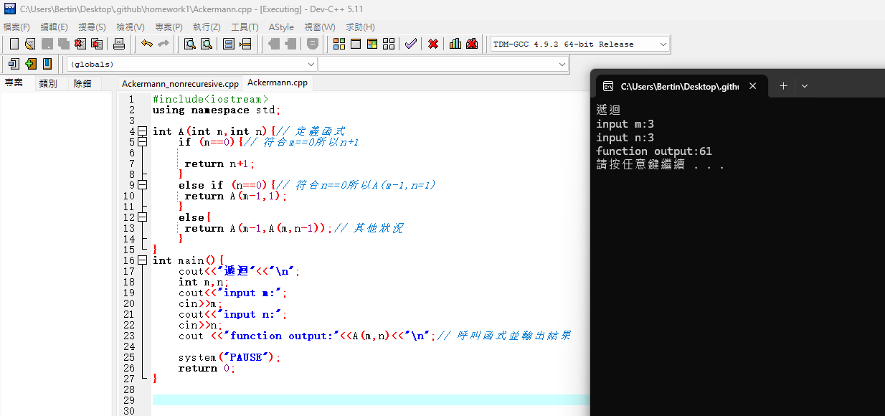
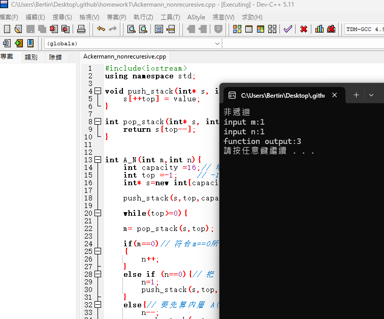
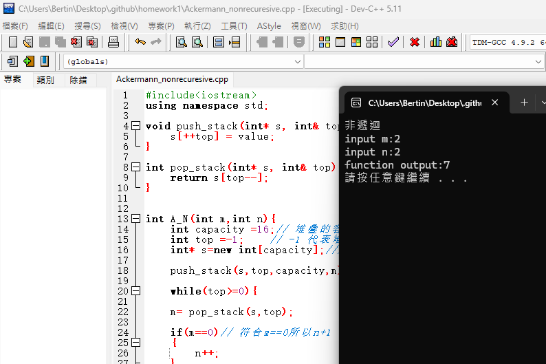
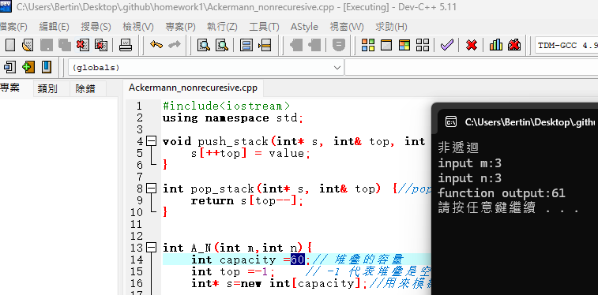
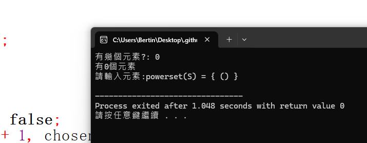
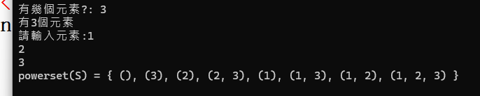
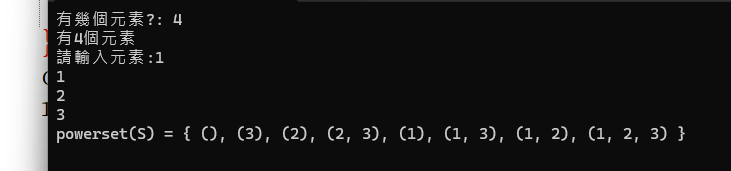

**41436107**

作業一：
Problem 1:Ackermann's Function之遞迴與非遞迴實作
Problem 2:powerset實作

--------------------

**Problem 1 解題說明**

本題要求針對極端快速成長的數學函數Ackermann's Function  $A(m, n)$ ，分別以**遞迴（Recursive）**與**非遞迴（Nonrecursive）**兩種方法實現，並輸出計算結果。

Ackermann's Function定義如下：



**Problem 1解題策略**

1. **遞迴版本（Recursive Approach）**：
   直接依據數學定義進行條件判斷：
    **基底條件 1**：當 $m = 0$ 時，直接回傳 $n + 1$。
    **遞迴條件 1**：當 $n = 0$ 時，轉化為計算 $A(m - 1, 1)$。
	**遞迴條件 2**：其餘狀況，先求解內層 $A(m, n - 1)$，再將結果作為參數傳入外層 A(m - 1, 內層結果 )。

2. **非遞迴版本（Non-recursive Approach）**：
   使用陣列模擬堆疊（Stack）結構，儲存等待處理的 $m$ 值。
   將初始 $m$ 推入堆疊，並以迴圈在堆疊不為空（`top >= 0`）時進行處理：
   取出當前的 $m$。
   若 $m = 0$，則更新 $n = n + 1$。
   若 $n = 0$，將 $m - 1$ 推回堆疊，並設 $n = 1$。
   其餘狀況（$m > 0$ 且 $n > 0$），更新 $n = n - 1$，並依序將 $m - 1$ 與 $m$ 推回堆疊，模擬雙重遞迴的計算邏輯。

--------------------

**Problem 1程式實作**

以下為主要程式碼：

遞迴版本

```cpp
#include<iostream>
using namespace std;

int A(int m,int n){// 定義函式 
	if (m==0){// 符合m==0所以n+1 
	
	 return n+1;	
	}
	else if (n==0){// 符合n==0所以A(m-1,n=1) 
	 return A(m-1,1);	
	}
	else{            
	 return A(m-1,A(m,n-1));// 要先算內層 A(m, n-1)，算完的結果才是外層 A(m-1, ?) 的第二個數
	} 
}
int main(){	
	cout<<"遞迴"<<"\n";
	int m,n;
	cout<<"input m:";
	cin>>m;
	cout<<"input n:";
	cin>>n;
	cout <<"function output:"<<A(m,n)<<"\n";// 呼叫函式並輸出結果 
	
	system("PAUSE");
	return 0;
}
```

--------------------

非遞迴版本

```cpp
#include<iostream>
using namespace std;

void push_stack(int* s, int& top, int capacity, int value) {//push函式（推入） 
    s[++top] = value;
}

int pop_stack(int* s, int& top) {//pop函式（彈出） 
    return s[top--];
}


int A_N(int m,int n){
	int capacity =60;// 堆疊的容量
	int top =-1;// -1 代表堆疊是空的
	int* s=new int[capacity];//用來模擬遞迴的呼叫堆疊
	
	push_stack(s,top,capacity,m);// 先把初始的 m 推入堆疊

	while(top>=0){
	
	m= pop_stack(s,top);
	
	if(m==0)// 符合m==0所以n+1 
	{
		n++;
	}
	else if (n==0){// 把 n 設為 1，並把 m-1 推入堆疊等下一輪處理
		n=1;
		push_stack(s,top,capacity,m-1);
	}
	else{// 要先算內層 A(m, n-1)，算完的結果才是外層 A(m-1, ?) 的第二個數
		n--;
		push_stack(s,top,capacity,m-1);
		push_stack(s,top,capacity,m);
	}	
	}
	
	delete[] s;
	return n;
} 

int main(){
	cout<<"非遞迴"<<"\n";
	int m,n;
	cout<<"input m:";
	cin>>m;
	cout<<"input n:";
	cin>>n;
	
	cout<<"function output:"<<A_N(m,n)<<"\n";// 呼叫函式並輸出結果 
	
	system("PAUSE");
	return 0;
	
}
```

--------------------

**Problem 1效能分析**


1.  此函數的數值與計算步驟隨著 $m$ 的增加而暴增：
    $m = 0$：$O(1)$
    $m = 1$：$O(n)$，實質計算 $n + 2$
    $m = 2$：$O(n)$，實質計算 $2n + 3$
    $m = 3$：$O(2^n)$，呈現指數級成長
    $m = 4$：$O(2^{2^{.^{.^{2}}}})$（巨幅暴增）
   
   因此整體時間複雜度為 **$O(A(m, n))$**。

2. **空間複雜度**：
   * **遞迴版本**：依賴系統呼叫堆疊（Call Stack），深度與阿克曼函數計算過程中的深度成正比，空間複雜度為 **$O(A(m, n))$**。當 $m \ge 4$ 時會極快導致**堆疊溢出**(Stack Overflow)。
   * **非遞迴版本**：使用動態陣列模擬堆疊，空間複雜度同樣為 **$O(\text{Max Stack Depth})$**。雖然避開了系統 Stack Overflow 的限制，但仍受限於實體記憶體大小與自訂 `capacity` 邊界（例如程式中的 `capacity = 16` 在稍大輸入下可能溢出，可調整為更靈活的動態擴容）。

--------------------

**Problem 1測試與驗證**

**遞迴**




--------------------

**非遞迴**




非遞迴A(3,3)我改變了堆疊容量的大小 16 -> 60

--------------------

**Problem 1結論**

1. 遞迴與非遞迴版本均能正確算出函數的數值。
2. 測試案例驗證了 $m=0$、$n=0$ 以及一般 $m, n > 0$ 等多種邊界條件與一般狀況下的正確性。
3. 非遞迴版本透過陣列模擬 Stack，結果與遞迴版一致。

--------------------

**Problem 1申論與開發報告**

**遞迴與非遞迴的分析**

1. **遞迴版本的簡潔**：
   Ackermann's Function的數學定義本身即為遞迴結構。採用遞迴寫法能完美對映數學關係式，程式碼簡短且易讀，十分適合用於驗證演算法邏輯的正確性。

2. **非遞迴的開發重點與挑戰**：
    Ackermann's Function複雜的地方在於 $A(m-1, A(m, n-1))$ 的雙重嵌套。在非遞迴實作中，透過將外層的 $m-1$ 與當前 $m$ 依序壓入堆疊，將雙重遞迴轉化為單一主迴圈中的狀態更新，成功還原了函數執行時的上下文維護。
    遞迴版本的 Call Stack 大小受限於作業系統環境，極易引發 Stack Overflow；非遞迴版本用new int[capacity]動態配置記憶體，使程式可彈性調整堆疊容量，提升了系統在較大輸入下的穩定度與可控性。

3. **開發總結**：
   透過本次實作，理解系統 Call Stack 與自訂 Stack 之間的差別。
   雖然非遞迴版本解決了系統呼叫堆疊溢出的問題，但由於Ackermann's Function本身爆炸性的計算複雜度，當 $m \ge 4$ 時，即便使用非遞迴演算法，也會因為運算時間過長或堆疊記憶體耗盡而無法在合理時間內算完。

--------------------
--------------------
--------------------

**Problem 2 解題說明**

本題要求撰寫遞迴函式，列出集合 $S$ 的冪集（powerset），
也就是 $S$ 所有可能的子集。對於包含 $m$ 個元素的集合，
共有 $2^m$ 個子集（包含空集合與 $S$ 本身）。

**Problem 2 解題策略**

1. **排序與去重複**：
   集合不允許重複元素。輸入後先用 sort() 排序，使重複元素相鄰，
   再用 unique() 移除相鄰的重複元素，並計算出實際集合大小 $m$。

2. **分支選擇遞迴**：
   對每個元素 `p[index]`，只有「不選」與「選」兩種分支：
   * **分支 1（不選）**：chosen[index] = false，遞迴處理 index + 1
   * **分支 2（選）**：chosen[index] = true，遞迴處理 index + 1

   每次遞迴 index 都加 1，因此會逐步逼近 Base Case。

3. **Base Case 與輸出格式控制**：
   當 `index == m`，表示所有元素都已決定完畢，
   依據 `chosen[]` 輸出目前的子集。
   使用 `is_first_subset` 控制子集之間的逗號，
   使用 `first_element` 控制同一子集內元素之間的逗號。

--------------------

**Problem 2 程式實作**

以下為主要程式碼：

```cpp
#include <iostream>
#include <algorithm>
using namespace std;

int m;						 // 去重複元素後的集合大小
bool is_first_subset = true; // 控制 subset 之間的逗號

void powerset(int index, bool* chosen, char* p)
{

    if (index == m)
    {
        if (!is_first_subset)
            cout << ", ";
        is_first_subset = false;

        cout << "(";
        bool first_element = true;
        for (int i = 0; i < m; i++)// 掃過全部 m 個元素，看哪些被選進 subset
        {
            if (chosen[i])
            {
                if (!first_element)// 如果不是 subset 的第一個元素，先逗號隔開
                    cout << ", ";
                cout << p[i];
                first_element = false;
            }
        }
        cout << ")";
        return;
    }

    // false：不選
    chosen[index] = false;
    powerset(index + 1, chosen, p);

    // true：選
    chosen[index] = true;
    powerset(index + 1, chosen, p);
}

int main()
{
    int n;
    cout << "有幾個元素?: ";
    cin >> n;
	cout << "有"<<n<<"個元素 "<<"\n";
	
    char* input = new char[n];
    cout << "請輸入元素:";
    for (int i = 0; i < n; i++)
        cin >> input[i];

    // 排序並去掉重複元素 
    sort(input, input + n);
    m = unique(input, input + n) - input;

    bool* chosen = new bool[m];// 初始化：一開始所有元素都設為「沒選」
    for (int i = 0; i < m; i++)
        chosen[i] = false;

    cout << "powerset(S) = { ";
    powerset(0, chosen, input);// 呼叫遞迴函式，從 index = 0（第一個元素）開始決定
    cout << " }" << endl;
    
	//釋放配置的記憶體
    delete[] chosen;
    delete[] input;
    return 0;
}
```

--------------------

**Problem 2 效能分析**

1. **空間與時間複雜度**：
經 sort ($O(n \log n)$) 與 unique ($O(n)$) 預處理去重複後，透過反覆遞迴產生 $2^m$ 個分支節點並印出長度最多為 $m$ 的子集，整體時間複雜度為達到理論下限的 $O(m \cdot 2^m)$；其空間複雜度包含動態陣列配置與最大遞迴深度 $m$，僅需線性的 $O(n)$ 空間，極為高效且安全。

--------------------

**Problem 2 測試與驗證**

**測試**





--------------------

**Problem 2 結論**

1. 程式成功運用反覆遞迴的分支決策生成所有 $2^m$ 個可能的子集。
2. 結合 sort 與 unique 成功處理輸入重複元素的問題，確保輸出符合數學上「集合」的定義。

--------------------

**Problem 2 申論與開發報告**

1. **分支決策與遞迴**：
   在每一次遞迴呼叫中，程式會針對當前元素進行分支決策：分支一為「不選取當前元素（false）」，分支二為「選取當前元素（true）」。透過遞迴向下展開，程式能不重不漏地列舉出所有 $2^m$ 種分支組合。

2. **集合去重複**：
   若使用者輸入重複字元（如 a, a, b），標準 Powersets 不應出現重複子集。透過標準庫 sort 與 unique 的組合，能以 $O(n \log n)$ 的成本將任意輸入規範化為符合數學定義的標準集合。
